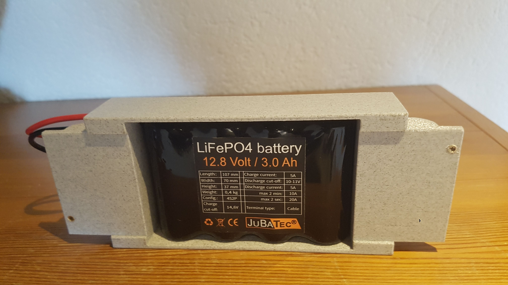
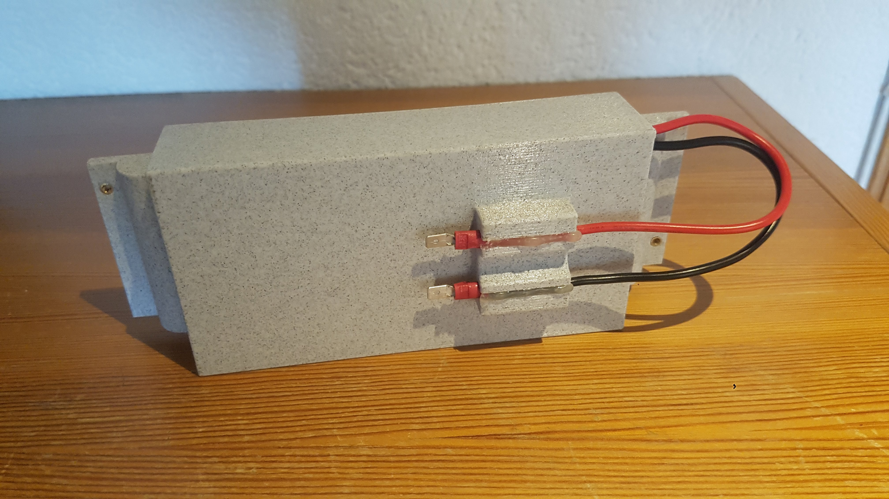

# Becker Bodenstation LiFePO4 Akku-Halter
Replacement of the PB accu with a LiFePO4 accu holder for the portable VHF stations GK615-XX.

## BOM
- [LiFePO4 Accu](https://www.jubatec.net/LiFePO4-Akku-12V-3Ah-in-flacher-Ausfuehrung-mit-BMS-Batterie-Management-System.html)
- [M3*4-4.2 female brass insert](https://de.aliexpress.com/i/1005002069529871.html?gatewayAdapt=glo2deu) 2 pcs
- [AMP Flachsteckzunge 4.8 mm](https://www.jumbo.ch/de/hobby-sport/autozubehoer/zubehoer-innen/kleinaccessoires/umove-flachsteckzunge--48-mm--10-stueck/p/6907952?trackingtoken=product%7Carea2%7CA%7CStandardkampagne%7Cordered_together_PDP%7Cordered_together_PDP#) 2 pcs
- PLA Filament

Print with PLA infill 25%